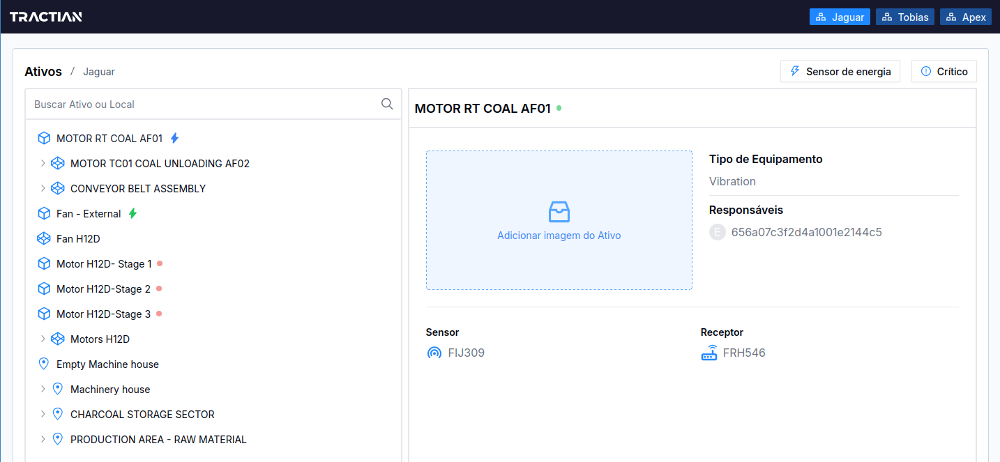

# Tractian Frontend Challenge

## 📕 Challenge

[Link to the challenge](https://github.com/tractian/challenges/blob/main/front-end/README.md)

## 📽️ Video

## 📝 Points of the project that I would improve

1. **Virtual Scrolling**: I would implement virtual scrolling to improve the performance of the application when rendering a large amount of data.
2. **Loading Skeleton**: I would add more loading skeletons to improve the user experience while the data is being loaded.
3. **Split recursive algorithms**: I would split the recursive algorithms into many threads to improve the performance of the application.
4. **Check algorithm complexity**: I would check the complexity of the algorithms to improve the performance of the application.